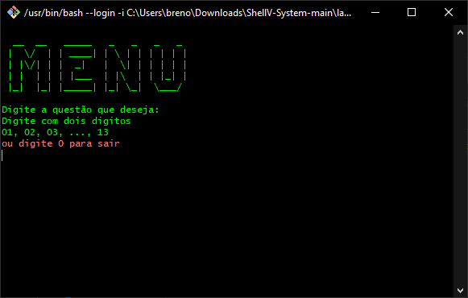
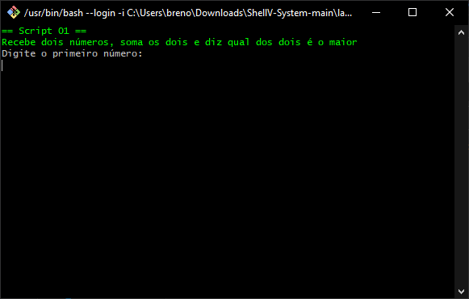
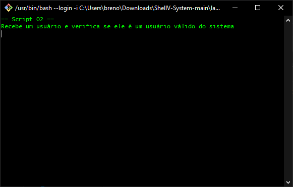
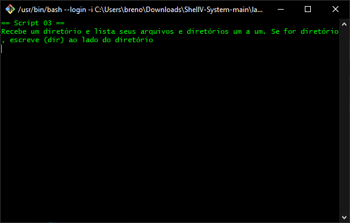
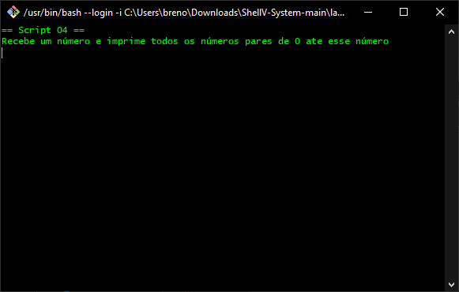
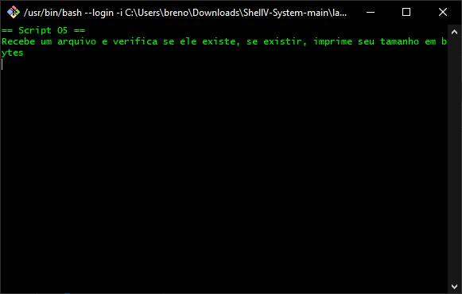

# lab_prog
Projeto proposto pelo Prof. Ramon Santos Nepomuceno na cadeira de laboratório de programação, na qual consistia em criar uma interface para acessar scripts escritos em Shell, que já haviam sido feitos em uma tarefa passada.

### Equipe
A porcentagem de participação no trabalho é:
Breno Mota do Nascimento 50%
Danilo Lacerda Silva 50%

## MENU
O menu foi criado usando uma imagem em ASCII e colorido com verde, assim como o resto do programa, para parecer com o filme MATRIX.

## Scripts
Os scripts foram feitos todos em uma atividade já passada em sala e implementados nesse novo projeto.
Segue algumas imagens dos scripts implementados no projeto.

